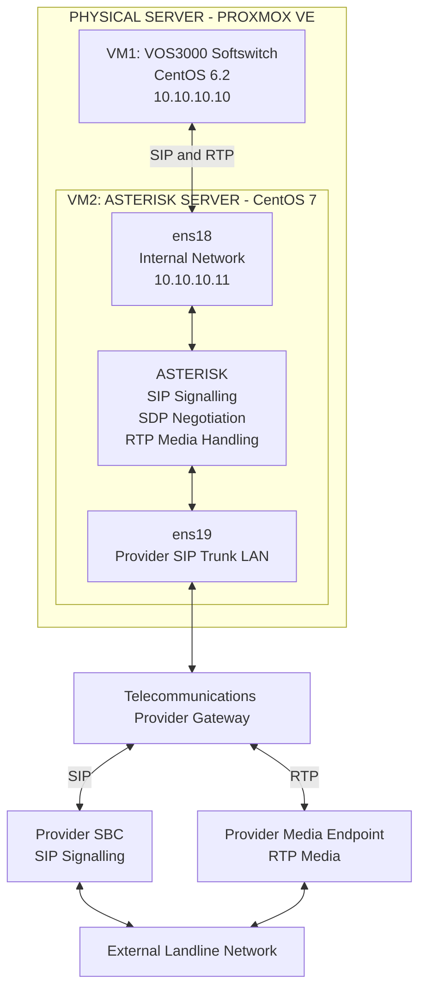
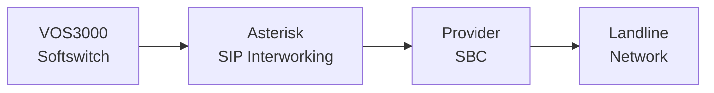
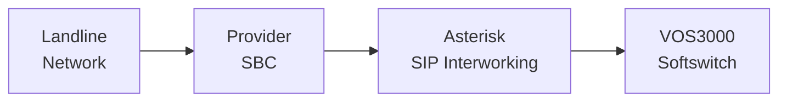
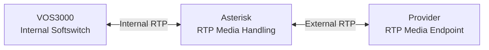

# NAT-Traversing Multi-Network VoIP Routing & SIP Media Interworking Platform

### Engineering Research, Network Architecture & Technical Implementation

**Author:** Mohammad Sorower Jahan  
**Role:** Lead VoIP & Network Infrastructure Engineer  
**Specialisation:** VoIP, SIP, RTP, Linux, Virtualisation, Network Infrastructure and Telecommunications Engineering

---

## 1. Project Overview

This repository documents the architecture and engineering implementation of a multi-network VoIP routing and SIP media interworking platform.

The platform was designed to establish telecommunications connectivity between otherwise isolated network environments.

The implementation integrated a VOS3000 Softswitch, an Asterisk telecommunications server, Linux-based virtualisation and an external landline SIP trunk infrastructure.

Asterisk provided application-level SIP signalling and RTP media interworking between the internal Softswitch network and the telecommunications provider's network.

The platform supported both inbound and outbound telecommunications calls.

The engineering implementation addressed the challenge of establishing reliable SIP signalling and bidirectional voice communication across different network environments.

---

## 2. Engineering Objectives

The principal engineering objectives were:

- Establish telecommunications connectivity between isolated network environments.
- Integrate the VOS3000 Softswitch with Asterisk.
- Establish SIP communication with an external telecommunications provider.
- Support inbound and outbound landline calls.
- Enable RTP media communication between the internal Softswitch and the external provider.
- Address network routing and SIP/SDP media connectivity challenges.
- Integrate Linux virtualisation, telecommunications services and multi-network infrastructure.
- Establish appropriate network connectivity to the provider's separate SIP signalling and RTP media endpoints.

---

## 3. Physical and Virtual Infrastructure

The original implementation used one physical server running Proxmox VE.

Two virtual machines were deployed within the Proxmox environment.

### Virtual Machine 1: VOS3000 Softswitch

| Parameter | Configuration |
|-----------|---------------|
| Virtualisation | Proxmox VE |
| Operating system | CentOS 6.2, 64-bit Minimal |
| Telecommunications application | VOS3000 |
| Internal IP address | 10.10.10.10 |
| Primary function | Softswitch and telecommunications call routing |

The VOS3000 Softswitch operated within the internal telecommunications network.

It communicated with the Asterisk server through a registration-based SIP gateway arrangement.

### Virtual Machine 2: Asterisk Server

| Parameter | Configuration |
|-----------|---------------|
| Virtualisation | Proxmox VE |
| Operating system | CentOS 7, 64-bit Minimal |
| Telecommunications application | Asterisk |
| Internal network interface | ens18 |
| Internal IP address | 10.10.10.11 |
| External network interface | ens19 |
| External connectivity | Provider SIP trunk LAN |
| Primary function | SIP signalling and RTP media interworking |

Asterisk operated as the intermediate telecommunications application between the internal Softswitch and the external provider.

It used separate network interfaces to communicate with the two network environments.

Both SIP signalling and RTP media passed through Asterisk.

---

## 4. Technology Stack

| Technology | Engineering Application |
|------------|-------------------------|
| Proxmox VE | Physical server virtualisation |
| CentOS 6.2 | VOS3000 virtual machine operating system |
| CentOS 7 | Asterisk virtual machine operating system |
| VOS3000 | Softswitch and telecommunications call routing |
| Asterisk | SIP signalling and RTP media interworking |
| SIP | Telecommunications call signalling |
| SDP | Media session negotiation |
| RTP | Real-time voice media transport |
| Static Routing | Connectivity between network environments |
| NAT | Network address translation within the surrounding infrastructure |
| DMZ | Network accessibility configuration |
| Port Forwarding | Network connectivity configuration |
| TCP/IP | Underlying network communication |

The operating-system versions listed above describe the original implementation and are not recommendations for new production deployments.

---

## 5. Network Architecture

The implementation incorporated an internal Softswitch network and a separate telecommunications provider network.

The VOS3000 Softswitch communicated with the Asterisk server through the internal network.

Asterisk used its second network interface to communicate with the external provider's SIP trunk infrastructure.

The provider used separate endpoints for SIP signalling and RTP media.

### 5.1 Logical Architecture Diagram

This diagram illustrates the logical architecture of the implementation.

It does not reproduce the complete physical topology or confidential production network configuration.

---

## 6. SIP Gateway Integration

The VOS3000 Softswitch and Asterisk communicated through a registration-based SIP gateway arrangement.

Asterisk provided the intermediate SIP application connecting the Softswitch to the external telecommunications provider.

The original implementation used the traditional Asterisk SIP configuration file:

`sip.conf`

The Asterisk dialplan was configured using:

`extensions.conf`

These configuration components supported the relevant SIP endpoint handling and call-routing operations.

The exact historical registration parameters and authentication configurations are not included in this public repository.

---

## 7. Bidirectional Call Routing

The platform supported both outbound and inbound telecommunications calls.

### 7.1 Outbound Calls

The outbound call path was:

**VOS3000 → Asterisk → Provider SBC → Landline Network**

The VOS3000 Softswitch initiated the outbound call towards Asterisk.

Asterisk processed the incoming SIP request and established the corresponding outbound call towards the telecommunications provider.

The provider handled the external landline connection.

### 7.2 Inbound Calls

The inbound call path was:

**Landline Network → Provider SBC → Asterisk → VOS3000**

The provider delivered the incoming call to Asterisk.

Asterisk processed the SIP request and established the corresponding call towards the internal VOS3000 Softswitch.

---

## 8. RTP Media Interworking

The external telecommunications provider used a separate media endpoint for RTP communication.

The implementation maintained Asterisk in the media path.

The internal Softswitch did not require direct RTP communication with the external provider's media endpoint.

### RTP Media Architecture

Asterisk exchanged RTP media with the internal Softswitch and the external telecommunications provider.

The implementation required appropriate SDP negotiation, network routing and media connectivity to establish the corresponding voice communication paths.

---

## 9. Network Routing and Interworking

The Asterisk server used separate network interfaces to communicate with the internal Softswitch and the external telecommunications provider.

Static routing was configured to establish connectivity with the provider's SIP signalling and RTP media endpoints.

The surrounding infrastructure also incorporated NAT, DMZ and port forwarding as part of the overall network connectivity arrangement.

**Asterisk did not perform IP-level NAT between its internal and external network interfaces.**

Instead, it operated as an application-level telecommunications intermediary, handling SIP signalling and RTP media between the two network environments.

This distinction is important to understanding the engineering implementation.

The platform established telecommunications communication between networks without requiring Asterisk to function as a conventional IP packet-forwarding NAT router.

---

## 10. Engineering Challenges

### 10.1 Isolated Network Environments

The internal Softswitch and external provider operated within separate network environments.

The engineering implementation required an intermediate telecommunications application capable of communicating with both.

### 10.2 SIP Signalling and RTP Connectivity

The provider used separate endpoints for SIP signalling and RTP media.

The implementation required appropriate network routing and media negotiation to establish connectivity with both destinations.

### 10.3 Bidirectional Telecommunications

The platform supported both inbound and outbound telecommunications traffic.

The implementation required appropriate SIP endpoint handling and call-routing configuration for both directions.

### 10.4 Virtualised Telecommunications Infrastructure

The engineering work integrated VOS3000, Asterisk, Linux operating systems, Proxmox virtualisation and network infrastructure.

The implementation required coordination between telecommunications application configuration and the underlying network connectivity.

---

## 11. Engineering Implementation

My engineering work on this platform included:

- Designing the multi-network telecommunications architecture.
- Deploying the virtualised Linux server environment.
- Integrating VOS3000 and Asterisk.
- Configuring the internal and provider-facing network interfaces.
- Establishing connectivity between the isolated telecommunications environments.
- Configuring SIP gateway integration.
- Implementing inbound and outbound call-routing logic.
- Configuring connectivity to the provider's signalling and media infrastructure.
- Investigating SIP signalling, SDP negotiation and RTP media connectivity.
- Testing and refining the telecommunications implementation.

The platform provided bidirectional telecommunications connectivity between the internal Softswitch and the external landline infrastructure.

---

## 12. Technical Documentation

Detailed technical documentation is available in the following files.

| Document | Description |
|----------|-------------|
| [Technical Architecture](docs/architecture.md) | Physical infrastructure, virtual machines, logical network architecture and SIP/RTP media interworking. |
| [Network Routing](docs/network-routing.md) | Network interfaces, static routing, signalling and media connectivity, and bidirectional telecommunications. |
| [SIP Gateway Configuration](docs/sip-gateway-configuration.md) | VOS3000 and Asterisk integration, registration-based SIP gateway connectivity and inbound/outbound call processing. |

These documents provide additional information about the architecture and engineering methodology used in the implementation.

---

## 13. Documentation and Confidentiality

This repository documents historical engineering work.

It does not contain a complete production deployment or the original confidential telecommunications configuration.

Provider authentication credentials, customer information, sensitive infrastructure configurations and confidential production details are intentionally excluded.

Any future demonstration configurations will be identified as illustrative or reconstructed examples unless their historical origin can be verified.

The publication date of this repository should not be interpreted as the original implementation date of the engineering project.

---

## 14. Engineering Contribution

The project documents the design and implementation of a telecommunications platform connecting otherwise isolated network environments.

The implementation integrated a virtualised VOS3000 Softswitch, an Asterisk telecommunications server, multi-network routing and SIP/RTP media interworking.

The architecture supported inbound and outbound telecommunications communication between an internal Softswitch environment and an external landline SIP trunk provider.

The engineering work demonstrates the integration of telecommunications protocols, Linux infrastructure, virtualisation and network engineering to address practical communication challenges.

---

## 15. Author

**Mohammad Sorower Jahan**

Digital Technology & Telecommunications Infrastructure Engineer

**Technical Expertise:**

VoIP | SIP | SDP | RTP | Asterisk | VOS3000 | Linux | Proxmox | Network Infrastructure | Virtualisation

**GitHub:** [Core-daemon](https://github.com/Core-daemon)

**Professional Website:** [www.msjahan.com](https://www.msjahan.com)

---

*This repository provides technical documentation of an engineering implementation. It excludes confidential production configurations, authentication credentials and customer information.*
