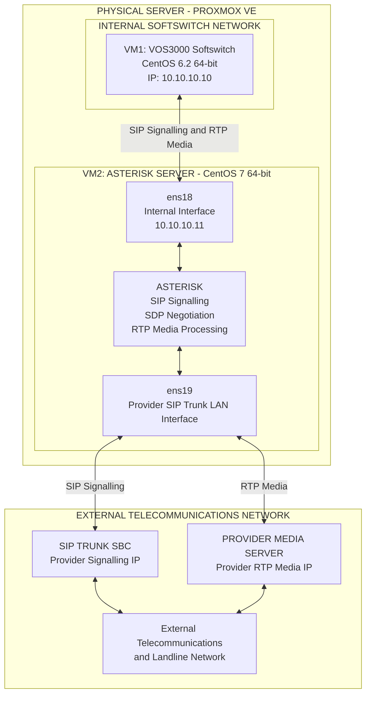
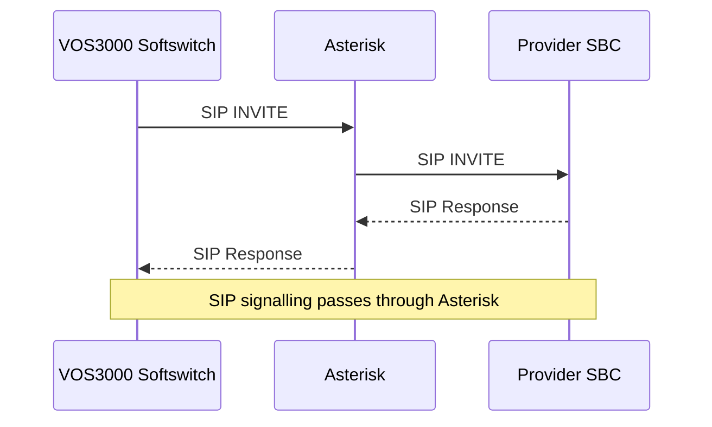
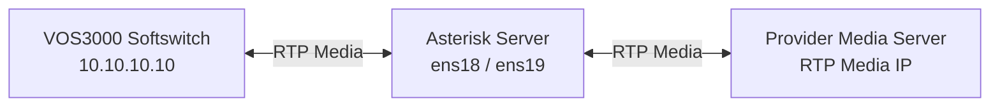

# Technical Architecture

## NAT-Traversing Multi-Network VoIP Routing & SIP Media Interworking Platform

**Author:** Mohammad Sorower Jahan

**Engineering Role:** Lead VoIP & Network Infrastructure Engineer

**Technology:** Proxmox VE, VOS3000, Asterisk, CentOS, SIP, SDP, RTP and IP Routing

---

## 1. Architecture Overview

This document describes the technical architecture of a multi-network VoIP routing and SIP media interworking platform.

The platform was designed to establish telecommunications connectivity between otherwise isolated network environments.

The implementation used a physical server running Proxmox VE with two virtual machines.

The first virtual machine hosted a VOS3000 Softswitch.

The second virtual machine hosted an Asterisk telecommunications server with two network interfaces.

Asterisk provided SIP signalling and RTP media interworking between the internal Softswitch network and the external telecommunications provider's SIP trunk network.

The infrastructure incorporated static routing, NAT, DMZ and port forwarding to establish the required network connectivity.

---

## 2. Infrastructure Components

### 2.1 Physical Infrastructure

The platform was deployed on one physical server running Proxmox VE.

Proxmox provided the virtualisation environment for the telecommunications infrastructure.

Two virtual machines were deployed within this environment.

### 2.2 Virtual Machine 1: VOS3000 Softswitch

**Operating System:** CentOS 6.2, 64-bit Minimal

**Application:** VOS3000 Softswitch

**Internal IP Address:** 10.10.10.10

The VOS3000 Softswitch operated within the internal telecommunications network.

It communicated with the Asterisk server through the internal network.

Asterisk provided the interworking function between the Softswitch and the external SIP trunk infrastructure.

### 2.3 Virtual Machine 2: Asterisk Server

**Operating System:** CentOS 7, 64-bit Minimal

**Application:** Asterisk

The Asterisk server was configured with two network interfaces.

| Interface | Configuration | Purpose |
|-----------|---------------|---------|
| ens18 | 10.10.10.11 | Internal Softswitch network |
| ens19 | Provider-assigned SIP trunk LAN IP | External telecommunications connectivity |

The ens18 interface provided connectivity to the internal Softswitch network.

The ens19 interface provided connectivity to the telecommunications provider's SIP trunk LAN.

Asterisk handled both SIP signalling and RTP media.

---

## 3. Network Architecture Diagram

The following diagram illustrates the logical architecture of the platform.

### Architecture Explanation

The VOS3000 Softswitch communicates with the Asterisk server through the internal network.

The Asterisk server uses its ens18 interface for communication with the Softswitch.

Its second interface, ens19, provides connectivity to the external telecommunications provider's SIP trunk LAN.

The provider's SBC handles SIP signalling, while a separate provider media IP is used for RTP media communication.

Both SIP signalling and RTP media pass through Asterisk.

The diagram represents the logical telecommunications architecture and does not expose confidential production routing information.

---

## 4. Network Interworking

### 4.1 Internal Network

The internal network connects the VOS3000 Softswitch and Asterisk server.

The Softswitch uses the internal IP address:

10.10.10.10

The Asterisk server uses:

10.10.10.11

These addresses provide connectivity between the two telecommunications applications within the internal network.

### 4.2 External SIP Trunk Network

The Asterisk server connects to the external telecommunications provider through its ens19 interface.

The provider's network includes separate IP addresses for SIP signalling and RTP media.

Asterisk provides the application-level interworking between the internal Softswitch and these external telecommunications services.

### 4.3 Network Connectivity

The implementation used a combination of:

- Static routing
- Network Address Translation (NAT)
- DMZ configuration
- Port forwarding

These networking mechanisms were incorporated to establish the required communication between the interconnected telecommunications environments.

The specific routing and NAT configuration must account for the network interfaces, gateway addresses, provider connectivity and required SIP/RTP communication paths.

---

## 5. SIP Signalling Architecture

The internal Softswitch and external SIP trunk use Asterisk as an intermediate telecommunications application.

A conceptual outbound SIP signalling path is illustrated below.

The Asterisk server communicates with the Softswitch through the internal network and with the provider's SBC through the external SIP trunk network.

The signalling configuration must account for the appropriate SIP transport, routing, addressing and session negotiation.

---

## 6. RTP Media Architecture

The implementation processes RTP media through the Asterisk server.

The internal Softswitch does not exchange RTP media directly with the external provider's media server in this documented architecture.

Instead, Asterisk provides the intermediate media handling function.

The conceptual RTP communication path is illustrated below.

### RTP Media Flow

The internal Softswitch exchanges voice media with Asterisk.

Asterisk processes the RTP media and exchanges the corresponding media streams with the external telecommunications provider.

The separate internal and external network interfaces allow Asterisk to communicate with the two telecommunications environments.

Correct SDP negotiation and network configuration are required to establish the appropriate RTP communication paths.

---

## 7. Engineering Problem

The principal engineering challenge addressed by this implementation was establishing telecommunications communication between otherwise isolated network environments.

The internal Softswitch and the external telecommunications provider operated through different network interfaces and addressing environments.

The provider also used separate IP addresses for SIP signalling and RTP media.

Establishing functional telecommunications connectivity required the integration of:

- Asterisk telecommunications services
- VOS3000 Softswitch infrastructure
- Multiple network interfaces
- IP routing
- NAT and network accessibility configuration
- SIP signalling
- SDP media negotiation
- RTP media transport

The engineering solution incorporated Asterisk as an interworking component between the internal Softswitch environment and the external SIP trunk network.

---

## 8. Engineering Implementation

The implementation involved deploying the Softswitch and Asterisk applications within separate Proxmox virtual machines.

The Asterisk virtual machine was configured with two network interfaces to support connectivity with the internal Softswitch network and external telecommunications provider.

The network infrastructure incorporated static routing, NAT, DMZ and port forwarding.

SIP signalling and RTP media handling were configured through Asterisk.

The engineering objective was to establish communication between the internal telecommunications platform and the provider's external telecommunications infrastructure despite the separation between their network environments.

---

## 9. Technical Validation

The following checks describe the principal areas relevant to validating this architecture.

### Internal Connectivity

Verify IP connectivity between the Softswitch and Asterisk internal network interface.

### External Connectivity

Verify that Asterisk can reach the external telecommunications provider's SBC and media IP through the provider-facing interface.

### SIP Signalling

Verify SIP signalling between the Softswitch, Asterisk and external SBC.

### RTP Media

Verify bidirectional RTP media communication between the Softswitch and Asterisk, and between Asterisk and the provider's media infrastructure.

### Network Routing

Verify that the configured network routes, NAT rules and firewall configuration support the required telecommunications communication paths.

---

## 10. Security and Confidentiality

This repository provides architectural and engineering documentation.

Confidential production information, authentication credentials, customer information and sensitive telecommunications configurations are excluded.

The provider-facing IP addresses are intentionally represented using descriptive labels.

The CentOS versions stated in this document describe the original implementation. They are historical operating-system versions and are not recommendations for new production deployments.

---

## 11. Engineering Contribution

Mohammad Sorower Jahan designed and implemented the telecommunications infrastructure described in this document.

The engineering work involved integrating the VOS3000 Softswitch, Asterisk, Linux virtual machines, network interfaces and telecommunications routing configuration.

The implementation addressed the technical challenge of establishing SIP and RTP communication between isolated telecommunications network environments.

This repository documents the architecture and engineering methodology of that implementation.

---

## 12. Documentation Status

This document describes the logical architecture of the original platform.

It does not constitute a complete production deployment guide.

Detailed routing tables, interface configurations, NAT rules, firewall rules and application configurations are not included in this public document.

Additional technical documentation may be added to explain specific implementation mechanisms using sanitised example configurations.

---

**Author:** Mohammad Sorower Jahan

**GitHub:** https://github.com/Core-daemon

**Professional Website:** https://www.msjahan.com
