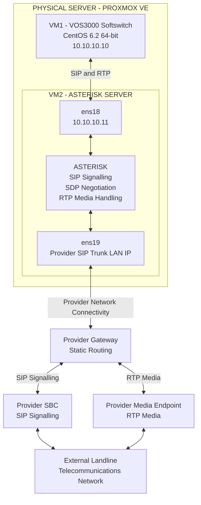
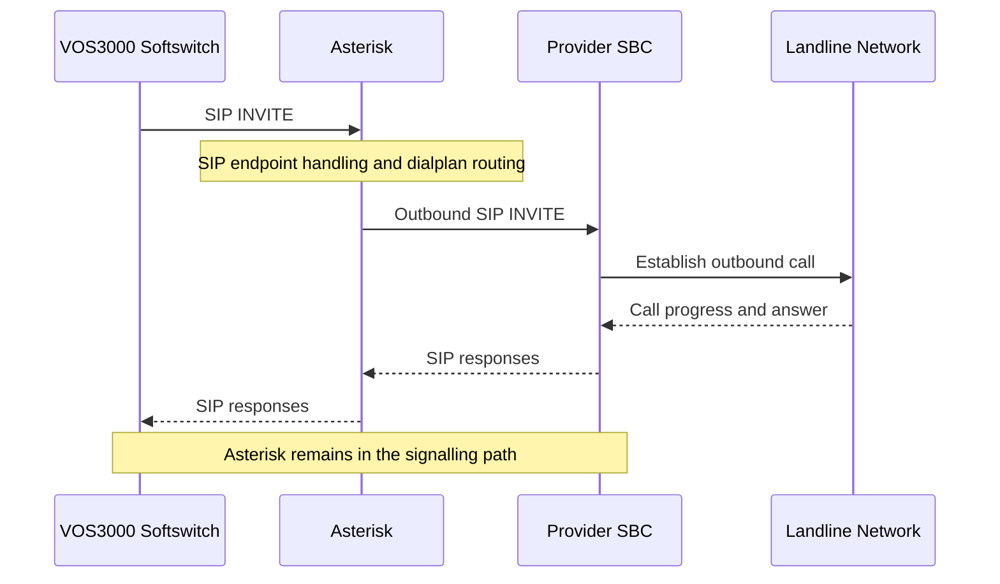
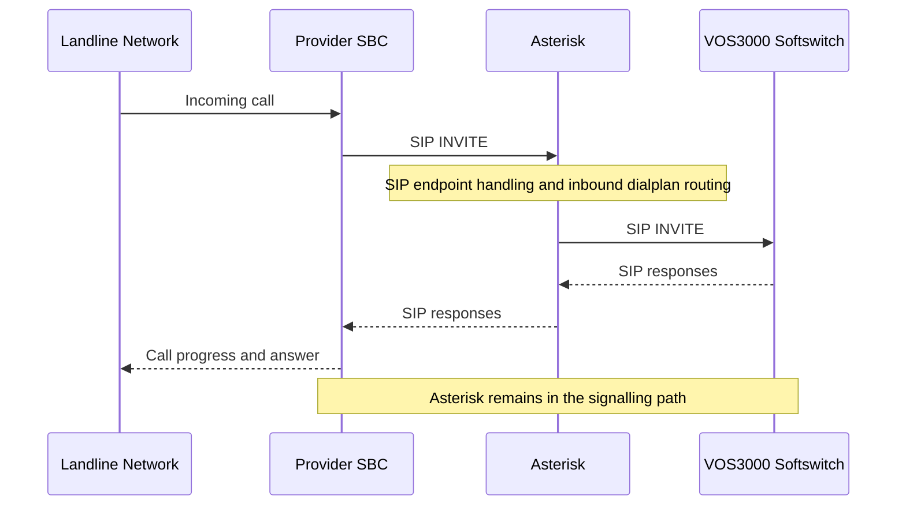

# Network Routing and SIP/RTP Interworking

## NAT-Traversing Multi-Network VoIP Routing & SIP Media Interworking Platform

**Author:** Mohammad Sorower Jahan

**Engineering Role:** Lead VoIP & Network Infrastructure Engineer

**Technology:** Proxmox VE, VOS3000, Asterisk, CentOS, SIP, SDP, RTP and Static Routing

---

## 1. Technical Overview

This document describes the network routing and telecommunications interworking architecture of a VoIP platform designed to establish communication between isolated network environments.

The implementation incorporated a VOS3000 Softswitch, an Asterisk telecommunications server and an external telecommunications provider's SIP trunk infrastructure.

Both telecommunications applications operated within separate Proxmox virtual machines hosted on one physical server.

The VOS3000 Softswitch operated within an internal telecommunications network.

The Asterisk server provided the intermediate telecommunications application connecting the internal Softswitch environment to the external provider's SIP trunk network.

Asterisk was configured with two network interfaces, allowing it to communicate with both network environments.

The provider used separate IP endpoints for SIP signalling and RTP media.

The implementation incorporated static routing to establish connectivity with the provider's signalling and media infrastructure.

Asterisk processed both SIP signalling and RTP media.

The principal engineering objective was to establish bidirectional telecommunications communication between otherwise isolated networks.

---

## 2. Physical and Virtual Infrastructure

The infrastructure consisted of one physical server running Proxmox VE.

Two virtual machines were deployed within the Proxmox environment.

### Virtual Machine 1: VOS3000 Softswitch

| Parameter | Configuration |
|-----------|---------------|
| Operating system | CentOS 6.2, 64-bit Minimal |
| Telecommunications software | VOS3000 |
| Internal IP address | 10.10.10.10 |
| Primary function | Softswitch and call routing |

The VOS3000 Softswitch operated within the internal telecommunications network.

It communicated with the Asterisk server through a registered SIP gateway arrangement.

The Softswitch supported both inbound and outbound telecommunications call routing through the Asterisk interworking server.

### Virtual Machine 2: Asterisk Server

| Parameter | Configuration |
|-----------|---------------|
| Operating system | CentOS 7, 64-bit Minimal |
| Telecommunications software | Asterisk |
| Internal interface | ens18 |
| Internal IP address | 10.10.10.11 |
| Provider-facing interface | ens19 |
| Provider-facing IP address | Provider-assigned SIP trunk LAN address |
| Primary function | SIP signalling and RTP media interworking |

The Asterisk server operated as an application-level intermediary between the two telecommunications environments.

Its internal interface provided connectivity to the VOS3000 Softswitch.

Its provider-facing interface provided connectivity to the external SIP trunk infrastructure.

Asterisk did not perform IP-level NAT between its two network interfaces.

---

## 3. Network Architecture

The implementation incorporated two principal network environments.

### 3.1 Internal Softswitch Network

The internal network connected the VOS3000 Softswitch and the Asterisk server.

The following internal addresses were assigned:

| Component | IP Address |
|-----------|------------|
| VOS3000 Softswitch | 10.10.10.10 |
| Asterisk ens18 | 10.10.10.11 |

The internal network provided the communication path between the Softswitch and Asterisk.

### 3.2 External SIP Trunk Network

The external network connected the Asterisk server to the telecommunications provider.

The Asterisk server used its ens19 interface to communicate with the provider's network.

The provider infrastructure included separate endpoints for SIP signalling and RTP media.

The provider's SBC handled the SIP signalling connection.

A separate provider media endpoint handled RTP media communication.

The implementation required IP connectivity to both provider endpoints.

### 3.3 Logical Network Architecture



The diagram represents the logical network architecture.

It does not reproduce the complete provider network topology or confidential production routing configuration.

---

## 4. Static Routing Architecture

The Asterisk server required network connectivity to two different network environments.

The internal interface connected to the Softswitch network.

The external interface connected to the provider's SIP trunk LAN.

The provider's SBC signalling endpoint and RTP media endpoint used addresses outside the directly connected provider-facing network, requiring appropriate IP routing.

Static routing was configured on the Asterisk server to establish connectivity with the provider's signalling and media infrastructure.

### 4.1 Routing Requirements

The routing configuration needed to ensure that:

1. The internal Softswitch could communicate with the Asterisk internal interface.

2. Asterisk could reach the external provider's SBC signalling endpoint.

3. Asterisk could reach the provider's separate RTP media endpoint.

4. Return traffic from the provider could reach the appropriate Asterisk interface.

5. Telecommunications traffic used the appropriate network interface and routing path.

### 4.2 Logical Routing Model

```text
INTERNAL TELECOMMUNICATIONS NETWORK
              |
              |
      VOS3000 SOFTSWITCH
         10.10.10.10
              |
              |
              v
      ASTERISK SERVER
      ens18: 10.10.10.11
              |
              |
     SIP / RTP Interworking
              |
              |
      ASTERISK SERVER
      ens19: Provider LAN IP
              |
              |
              v
       PROVIDER GATEWAY
              |
        +-----+-----+
        |           |
        v           v
    SBC IP       MEDIA IP
        |           |
        +-----+-----+
              |
              |
              v
      LANDLINE NETWORK
```

The provider gateway was used to establish connectivity with the relevant provider network destinations.

Static routes enabled the Asterisk server to communicate with the provider's separate signalling and media endpoints.

---

## 5. SIP Gateway Integration

The VOS3000 Softswitch communicated with the Asterisk server through a registered SIP gateway arrangement.

Asterisk provided the SIP interworking function between VOS3000 and the external telecommunications provider.

The SIP configuration was implemented using Asterisk's traditional SIP configuration file:

`sip.conf`

The Asterisk dialplan was configured using:

`extensions.conf`

These configuration components supported SIP endpoint handling, registration where applicable and call routing.

### 5.1 SIP Registration

The internal Softswitch and Asterisk used a SIP gateway arrangement incorporating registration.

The registration mechanism enabled the telecommunications systems to establish the relevant SIP endpoint relationship.

The precise registration direction and authentication configuration are not reproduced in this public documentation.

### 5.2 SIP Call Processing

The Asterisk server handled SIP signalling received from the internal Softswitch and external provider.

The SIP configuration identified the relevant telecommunications endpoints.

The Asterisk dialplan controlled the corresponding call-routing behaviour.

---

## 6. Outbound Call Routing

The outbound telecommunications path was:

VOS3000 Softswitch → Asterisk → Provider SBC → External Landline Network.

### 6.1 Outbound SIP Signalling



### 6.2 Outbound Routing Explanation

The VOS3000 Softswitch initiated an outbound call towards the Asterisk server through the configured SIP gateway.

Asterisk received the SIP request through the internal network interface.

The configured SIP endpoint and dialplan settings determined how the call was handled.

Asterisk then initiated the corresponding outbound SIP signalling towards the telecommunications provider's SBC.

The provider established the external landline connection.

SIP responses travelled through Asterisk back towards the originating Softswitch.

---

## 7. Inbound Call Routing

The inbound telecommunications path was:

External Landline Network → Provider SBC → Asterisk → VOS3000 Softswitch.

### 7.1 Inbound SIP Signalling



### 7.2 Inbound Routing Explanation

The provider's SBC delivered incoming SIP signalling to the Asterisk server.

Asterisk received the request through its provider-facing network interface.

The SIP endpoint configuration and dialplan determined how the incoming call was processed.

Asterisk then established the corresponding call towards the internal VOS3000 Softswitch.

The Softswitch handled the call within the internal telecommunications environment.

---

## 8. SIP and RTP Media Separation

The telecommunications provider used different network endpoints for SIP signalling and RTP media.

The SIP signalling path involved the provider's SBC.

The RTP media path involved the provider's separate media endpoint.

The Asterisk server therefore required network connectivity to both endpoints.

### 8.1 SIP Signalling Path

```text
VOS3000
   |
   | SIP
   |
   v
ASTERISK
   |
   | SIP
   |
   v
PROVIDER SBC
```

### 8.2 RTP Media Path

```text
VOS3000
   |
   | RTP
   |
   v
ASTERISK
   |
   | RTP
   |
   v
PROVIDER MEDIA ENDPOINT
```

Both signalling and media passed through Asterisk.

However, the provider-facing SIP and RTP traffic used different destination endpoints.

This required the network routing configuration to support both provider destinations.

---

## 9. RTP Media Interworking

Asterisk handled RTP media between the internal Softswitch and the provider's external media infrastructure.

The platform did not rely on direct RTP communication between the VOS3000 Softswitch and the provider's media endpoint.

Instead, Asterisk remained in the media path.

### 9.1 Bidirectional RTP Flow


The internal Softswitch exchanged RTP media with Asterisk.

Asterisk exchanged the corresponding RTP media with the provider's media endpoint.

This arrangement provided an application-level intermediary between the internal and external telecommunications networks.

Correct SIP/SDP negotiation, routing and network accessibility were required to establish the necessary media communication paths.

---

## 10. Application-Level Interworking Versus IP-Level NAT

An important aspect of the implementation was the distinction between telecommunications interworking and IP-level network address translation.

Asterisk did not perform IP-level NAT between its ens18 and ens19 interfaces.

Instead, Asterisk acted as an application-level telecommunications intermediary.

It received SIP signalling and RTP media through the relevant interface and handled the corresponding signalling and media communication with the other telecommunications environment.

This approach differed from directly forwarding IP packets between the internal Softswitch network and the external provider's network.

The surrounding infrastructure also incorporated NAT, DMZ and port forwarding as part of the overall connectivity arrangement.

The exact placement and configuration of those network mechanisms are outside the scope of this document.

---

## 11. Engineering Challenges

### 11.1 Isolated Network Environments

The internal Softswitch and external provider operated within separate network environments.

The implementation required a telecommunications interworking component capable of communicating with both.

### 11.2 Separate Provider Signalling and Media Endpoints

The provider used separate network endpoints for SIP signalling and RTP media.

The Asterisk server required appropriate routing and connectivity to both destinations.

### 11.3 Bidirectional Call Processing

The platform supported both inbound and outbound telecommunications traffic.

The implementation required appropriate SIP endpoint handling and dialplan routing for both call directions.

### 11.4 RTP Media Connectivity

The implementation required bidirectional RTP communication between the internal Softswitch, Asterisk and the provider's media infrastructure.

Maintaining Asterisk in the media path allowed it to handle the corresponding media sessions between the two telecommunications environments.

---

## 12. Engineering Implementation Summary

The implementation combined:

- One physical Proxmox server.
- Two Linux virtual machines.
- VOS3000 Softswitch.
- Asterisk telecommunications services.
- Registered SIP gateway integration.
- Dual-interface network connectivity.
- Static routing to provider infrastructure.
- SIP signalling and dialplan configuration.
- Bidirectional call routing.
- RTP media interworking.

The resulting architecture established telecommunications connectivity between the internal Softswitch environment and the external landline SIP trunk infrastructure.

Asterisk provided the intermediate telecommunications application through which both SIP signalling and RTP media were handled.

---

## 13. Security and Documentation Limitations

This document is a technical record of the original engineering implementation.

Provider-facing production IP addresses, authentication credentials, detailed firewall rules and confidential telecommunications configurations are intentionally excluded.

The internal IP addresses are included to illustrate the logical relationship between the two virtual machines.

The CentOS versions describe the historical implementation and should not be interpreted as recommendations for a new production deployment.

The document describes the original architecture rather than providing a complete installation or production configuration guide.

---

## 14. Engineering Contribution

**Mohammad Sorower Jahan**

Lead VoIP & Network Infrastructure Engineer

The engineering work documented in this project included designing and implementing a telecommunications platform that interconnected otherwise isolated networks.

The implementation integrated VOS3000, Asterisk, Linux virtualisation, network routing and SIP/RTP media handling.

The architecture enabled inbound and outbound telecommunications communication between the internal Softswitch and external landline SIP trunk infrastructure.

This document records the network architecture, call-routing methodology and application-level interworking approach used in the implementation.

---

**GitHub:** https://github.com/Core-daemon

**Professional Website:** https://www.msjahan.com
