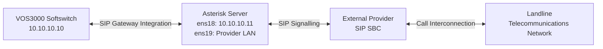
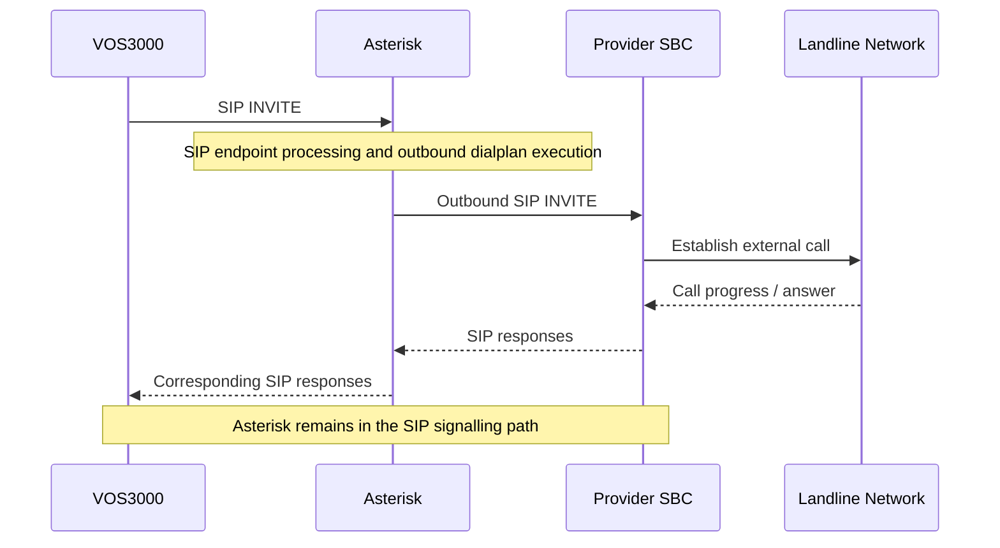
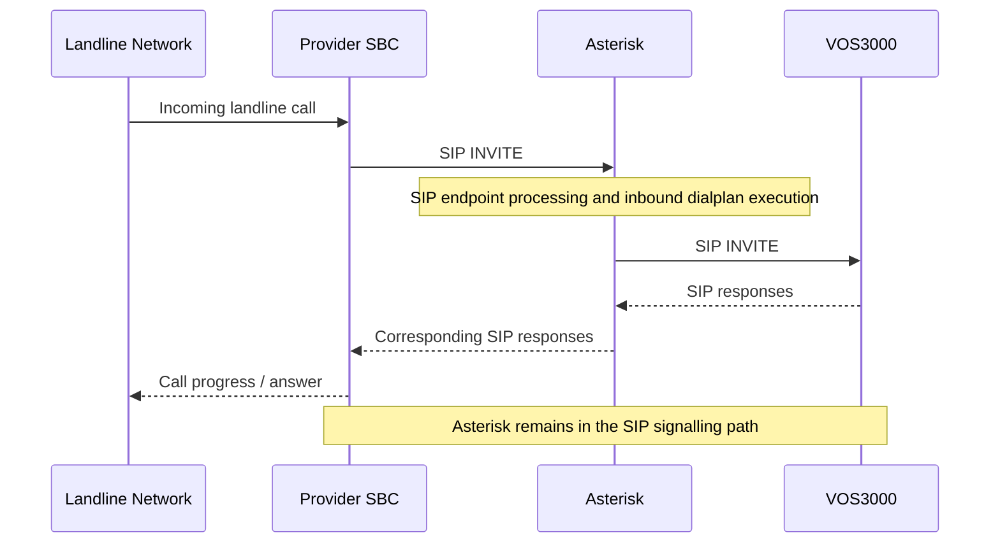
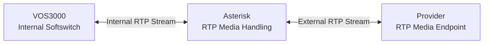

# SIP Gateway Configuration and Call Processing

## NAT-Traversing Multi-Network VoIP Routing & SIP Media Interworking Platform

**Author:** Mohammad Sorower Jahan

**Engineering Role:** Lead VoIP & Network Infrastructure Engineer

**Technologies:** VOS3000, Asterisk, SIP, SDP, RTP, Linux and Proxmox VE

---

## 1. Technical Overview

This document describes the SIP gateway integration and call-processing architecture of a telecommunications platform connecting an internal VOS3000 Softswitch to an external landline SIP trunk infrastructure.

The platform used two virtual machines hosted on a physical Proxmox server.

The first virtual machine hosted the VOS3000 Softswitch.

The second virtual machine hosted Asterisk, which provided SIP signalling and RTP media interworking between the internal Softswitch and the external telecommunications provider.

The VOS3000 Softswitch and Asterisk communicated through a registration-based SIP gateway arrangement.

Asterisk used separate network interfaces to communicate with the internal Softswitch and the telecommunications provider.

The implementation supported both inbound and outbound telecommunications calls.

---

## 2. SIP Gateway Infrastructure

### 2.1 VOS3000 Softswitch

The VOS3000 Softswitch was deployed on a CentOS 6.2 64-bit Minimal virtual machine.

Its internal IP address was:

`10.10.10.10`

The Softswitch provided the internal telecommunications call-routing environment.

It communicated with the Asterisk server through a registered SIP gateway arrangement.

### 2.2 Asterisk Server

The Asterisk server was deployed on a separate CentOS 7 64-bit Minimal virtual machine.

The server used two network interfaces.

| Interface | Address | Function |
|-----------|---------|----------|
| ens18 | 10.10.10.11 | Internal Softswitch connectivity |
| ens19 | Provider-assigned LAN address | External SIP trunk connectivity |

Asterisk acted as the intermediate telecommunications application between the internal VOS3000 platform and the external telecommunications provider.

Both SIP signalling and RTP media passed through Asterisk.

---

## 3. SIP Gateway Architecture

The platform's logical signalling architecture is illustrated below.

The internal Softswitch communicated with Asterisk through the internal network.

Asterisk established the corresponding SIP communication with the provider's external SBC.

The provider's media endpoint was separate from its signalling SBC.

RTP media was handled through Asterisk rather than being exchanged directly between the internal Softswitch and the external provider.

---

## 4. SIP Registration

The original implementation incorporated registration-based SIP gateway integration between VOS3000 and Asterisk.

SIP registration provides a mechanism for associating a SIP address of record with the relevant contact address.

The platform used this registration-based arrangement as part of the integration between the Softswitch and Asterisk.

The precise registration direction, authentication parameters and original SIP account configuration are not reproduced in this document.

Registration and call establishment are separate SIP operations.

A registered SIP gateway relationship does not, by itself, establish a telephone call. Call establishment requires the appropriate SIP signalling and call-routing configuration.

---

## 5. Asterisk SIP Configuration

The original implementation used the Asterisk SIP configuration file:

`sip.conf`

This file was used for the relevant SIP endpoint configuration.

Depending on the endpoint requirements, the traditional Asterisk SIP configuration can define:

- SIP peers and users.
- Authentication parameters.
- Registration settings.
- SIP transport and endpoint addressing.
- Network and NAT-related SIP settings.
- SIP contexts used for dialplan processing.
- Media negotiation parameters.

The original platform required appropriate SIP endpoint configuration for communication with the VOS3000 Softswitch and the external provider.

The exact historical configuration values are not included because they have not been independently recovered or verified.

### 5.1 Internal SIP Gateway

The internal SIP gateway arrangement connected the VOS3000 Softswitch to Asterisk.

The Softswitch used:

`10.10.10.10`

The Asterisk internal network interface used:

`10.10.10.11`

The SIP configuration enabled the relevant endpoint relationship between the two telecommunications applications.

### 5.2 External SIP Provider

The provider-facing SIP configuration enabled Asterisk to communicate with the external telecommunications provider's SBC.

The provider's SBC signalling address and RTP media address were separate.

The Asterisk server required network connectivity to both endpoints.

The external SIP configuration and network routing therefore needed to support the provider's signalling and media requirements.

---

## 6. Asterisk Dialplan Configuration

The implementation used:

`extensions.conf`

The Asterisk dialplan determined how received calls were processed and routed.

The dialplan provided the application-level logic required to connect the internal Softswitch environment with the external telecommunications provider.

The implementation supported two principal call directions:

1. Outbound calls originating from the VOS3000 Softswitch.

2. Inbound calls arriving from the external telecommunications provider.

The specific historical dialplan rules are not reproduced in this document.

---

## 7. Outbound Call Processing

The outbound call path was:

**VOS3000 → Asterisk → Provider SBC → Landline Network**

### 7.1 Outbound SIP Signalling

### 7.2 Outbound Call Processing Explanation

The VOS3000 Softswitch initiated an outbound call towards Asterisk through the configured SIP gateway.

Asterisk received the SIP request through its internal network interface.

The configured SIP endpoint and dialplan rules determined how the request was processed.

Asterisk established the corresponding outbound SIP communication towards the provider's SBC through the provider-facing network interface.

The provider handled the external landline call.

Call progress and response information returned through Asterisk towards the originating Softswitch.

---

## 8. Inbound Call Processing

The inbound call path was:

**Landline Network → Provider SBC → Asterisk → VOS3000**

### 8.1 Inbound SIP Signalling

### 8.2 Inbound Call Processing Explanation

The external telecommunications provider delivered the incoming SIP request to Asterisk.

Asterisk received the SIP signalling through its provider-facing network interface.

The SIP configuration identified the relevant endpoint and associated call-processing context.

The Asterisk dialplan determined the corresponding call-routing action.

Asterisk established the internal call leg towards the VOS3000 Softswitch.

The Softswitch then handled the call within the internal telecommunications environment.

---

## 9. RTP Media Interworking

The provider used separate endpoints for SIP signalling and RTP media.

The platform therefore required Asterisk to establish connectivity with both provider destinations.

The original implementation maintained Asterisk in the RTP media path.

### 9.1 RTP Media Architecture

The VOS3000 Softswitch exchanged RTP media with Asterisk.

Asterisk exchanged the corresponding RTP media with the provider's external media endpoint.

The two network interfaces provided connectivity to the respective telecommunications environments.

The platform did not require direct RTP connectivity between VOS3000 and the provider's media endpoint.

---

## 10. SIP and SDP Media Negotiation

SIP signalling was used to establish and manage the relevant telecommunications sessions.

SDP was used to negotiate the media parameters associated with those sessions.

The platform required appropriate handling of media addressing because the internal Softswitch and the external telecommunications provider operated in different network environments.

The provider's media endpoint was also separate from its SIP signalling SBC.

Asterisk provided the intermediate telecommunications application for the corresponding signalling and media communication.

The network configuration needed to ensure that Asterisk could communicate with the media destinations negotiated for each call.

---

## 11. Network Routing Considerations

The Asterisk server used separate network interfaces for its internal and external telecommunications connections.

The internal interface provided connectivity to the VOS3000 Softswitch.

The external interface provided connectivity to the telecommunications provider.

Static routing was configured to establish connectivity with the provider's separate SBC and RTP media endpoints.

Asterisk did not perform IP-level NAT between its internal and external interfaces.

Instead, it handled SIP signalling and RTP media at the telecommunications application level.

The surrounding infrastructure also incorporated NAT, DMZ and port forwarding as part of the overall network connectivity arrangement.

The detailed configuration of those external networking components is not reproduced here.

---

## 12. Engineering Challenges

### 12.1 Connecting Isolated Networks

The internal Softswitch and external provider operated within different network environments.

The engineering implementation required a telecommunications application capable of communicating with both.

Asterisk provided this intermediate function.

### 12.2 SIP Gateway Integration

The VOS3000 Softswitch and Asterisk required an appropriate SIP gateway configuration to establish their telecommunications relationship.

The original implementation incorporated SIP registration as part of this integration.

### 12.3 Bidirectional Call Routing

The platform supported both inbound and outbound telecommunications traffic.

The SIP configuration and Asterisk dialplan needed to support the appropriate call-processing paths for both directions.

### 12.4 Separate Signalling and Media Endpoints

The external provider used separate addresses for SIP signalling and RTP media.

The implementation required appropriate network routing and media negotiation to communicate with both endpoints.

### 12.5 RTP Media Handling

Asterisk remained in the RTP media path.

This enabled the internal Softswitch and external provider to exchange voice media through the intermediate telecommunications application without requiring direct RTP connectivity between their respective networks.

---

## 13. Engineering Implementation Summary

The original implementation incorporated:

- VOS3000 Softswitch on CentOS 6.2.
- Asterisk on CentOS 7.
- Proxmox-based virtualisation.
- Registration-based SIP gateway integration.
- Asterisk SIP endpoint configuration.
- Asterisk dialplan-based call routing.
- Separate internal and provider-facing network interfaces.
- Static routing to provider signalling and media destinations.
- Bidirectional inbound and outbound telecommunications calls.
- SIP signalling and RTP media interworking.

The resulting platform established telecommunications connectivity between an internal Softswitch environment and an external landline SIP trunk infrastructure.

---

## 14. Security and Documentation Limitations

This document describes the architecture of the original engineering implementation.

Authentication credentials, actual SIP account details, customer information and confidential provider configurations are excluded.

No historical Asterisk configuration files have been reproduced or represented as recovered production artefacts.

Any future configuration examples added to this repository should be clearly identified as illustrative examples or reconstructed demonstrations unless their historical origin can be verified.

The CentOS versions listed in this document describe the historical implementation and are not recommendations for new production deployments.

---

## 15. Engineering Contribution

**Mohammad Sorower Jahan**

Lead VoIP & Network Infrastructure Engineer

The engineering work documented in this project involved integrating the VOS3000 Softswitch, Asterisk telecommunications services, Linux infrastructure and multi-network connectivity.

The implementation supported SIP signalling and RTP media communication between otherwise isolated telecommunications networks.

The architecture enabled inbound and outbound call processing through an intermediate Asterisk server while maintaining separate connectivity to the internal Softswitch and the external provider's signalling and media infrastructure.

---

**GitHub:** https://github.com/Core-daemon

**Professional Website:** https://www.msjahan.com
